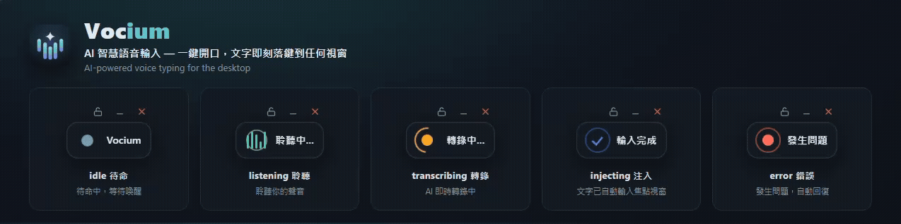

<p align="center">
  
</p>

<h1 align="center">Vocium</h1>

<p align="center">
  <b>AI‑powered voice typing for the desktop.</b><br/>
  Press a hotkey, speak, and your speech is transcribed by AI and inserted
  straight into whatever app you're working in.
</p>

<p align="center">
  <b>English</b> · <a href="#中文">繁體中文</a>
</p>

<p align="center">
  
</p>

---

## Features

- **Floating icon** pinned top‑center: always‑on‑top, frameless, translucent, never steals focus (your paste lands in the app you were typing in).
- **Five animated states** so you always know what's happening: idle (breathing) · listening (sound wave) · transcribing (spinner) · injected (check) · error (shake).
- **Two ways to trigger**: a **global hotkey** (default `Ctrl+Shift+Space`) or **clicking the icon**. Press `Esc` while listening to cancel.
- **Customizable hotkey** — a Settings window lets you **record a new combo and it applies instantly**, no restart. A taken/invalid combo is rejected and the old one is kept.
- **Hover controls** on the icon (fade in only on hover): 🔒 lock/unlock drag · ⎯ minimize to tray · ✕ quit.
- **Speech‑to‑text via Groq Whisper** (`whisper-large-v3-turbo`, bring‑your‑own‑key). No key? It pastes a short on‑screen prompt telling you to add your key in Settings (and STT errors paste a brief reason), so you're never left guessing.
- **Automatic paste** into the focused field (clipboard + simulated paste). If paste fails it degrades gracefully to "copied — paste manually".
- **System tray menu**: show/hide icon · STT mode · Settings… · open config location · quit.
- **Settings persisted** in `%APPDATA%/vocium/vocium-config.json` (hotkey, drag‑lock, icon position, STT provider, …).

## Requirements

- **Windows 11** (v1 target — text injection is pure PowerShell, zero native build).
- **Node.js ≥ 20**
- **Rust toolchain** + Tauri 2 prerequisites (Microsoft Edge **WebView2** runtime and MSVC build tools) — needed to build/run the shell.
- *(Optional)* a **Groq API key** for real transcription. Without one, Vocium prompts you (on paste) to add it in Settings.

> macOS / Linux: the injection interface and stubs are in place but `inject()` is not implemented in v1 (Phase 2).

## Install & Run

```bash
git clone <your-repo-url> vocium
cd vocium
npm install
npm run build        # compile the TypeScript sidecar
npm run dev          # build + launch the desktop app (tauri dev)
```

Produce a local build:

```bash
npx tauri build --config app-tauri/src-tauri/tauri.conf.json
```

> The produced binary is unsigned; installer packaging/signing is a later‑phase item.

## Get a free Groq API key (BYOK)

Vocium is **bring‑your‑own‑key**: there is no Vocium server and no bundled key. Your speech audio goes **directly from your machine to Groq** for transcription — nowhere else. No key → Vocium still works: it pastes a short prompt telling you to add your key in Settings (no fake transcription, no error animation).

1. Open **https://console.groq.com** and sign in with Google / GitHub (**no credit card**).
2. **API Keys** → **Create API Key** → copy the `gsk_...` value.
3. Put it in `groqApiKey` (config below) **or** paste it in the in‑app **Settings…** window. It is stored only on your machine and is git‑ignored. The easiest path: open the in‑app **Settings…** window and paste it into the **Groq API Key** field — it applies immediately (the transcription service restarts).

> **Free tier** — Groq's free developer tier is **rate‑limited, not usage‑billed**, and is plenty for personal voice typing. Your live limits: https://console.groq.com/settings/limits
>
> **Privacy (please read)** — with `sttProvider: "groq"` your spoken audio **leaves your computer** (sent to Groq for transcription). To keep everything fully offline, set `sttProvider: "mock"`.

## Configure

Settings live in `%APPDATA%\vocium\vocium-config.json` (created on first run). Example — **never commit your real key**:

```jsonc
{
  "hotkey": "Ctrl+Shift+Space",
  "sttProvider": "groq",            // "groq" | "mock"
  "groqApiKey": "<your-groq-key>",  // local only; if empty, paste shows a "set your key" prompt
  "groqModel": "whisper-large-v3-turbo",
  "maxListenMs": 30000,
  "dragLocked": false
}
```

The hotkey is also editable from the in‑app **Settings…** window (Tray → Settings…) and applies live. The config file is git‑ignored — your key never enters version control.

## Usage

1. Focus any text field (editor, browser, chat…).
2. Press the hotkey **or** click the floating icon → it enters **listening**.
3. Speak.
4. Press again (or it auto‑stops after `maxListenMs`) → it transcribes and **pastes the text into your focused field**. `Esc` while listening cancels (nothing is inserted).
5. Hover the icon to reveal the controls: lock drag · minimize to tray · quit. Re‑show from the tray icon.

## Design

Visual specs are kept as self‑contained HTML you can open in a browser:

- `docs/DESIGN_MOCKUP.html` — the floating icon, all five states, controls, and the settings window.
- `docs/ICON_DESIGN.html` — app‑icon concepts and the chosen mark.

The app‑icon master is the vector `app-tauri/src-tauri/icons/icon.svg`; run `npm run icons` to regenerate every PNG size + the multi‑resolution `.ico` from it.

> GitHub renders Markdown and images, **not** `.html` (clicking a mockup shows its source). The banner above is `docs/assets/showcase.png`, rendered from `docs/assets/showcase.html`. To view the interactive mockups, open the HTML files locally — or, once this repo is public, via GitHub Pages / a raw‑HTML viewer.

## Architecture (in one line)

A thin Tauri 2 (Rust) shell drives a Node sidecar that exposes the core logic over a single MCP protocol. Details in [`docs/SPEC.md`](docs/SPEC.md) and [`docs/ROADMAP.md`](docs/ROADMAP.md).

## Development

```bash
npm test         # vitest — core logic, config, injector, MCP integration
npm run icons    # regenerate icons from icon.svg
```

## Status

MVP, Windows‑first. Real Groq transcription integrated and verified on a real machine; in‑app API key field + no‑key/error guidance shipped. Not yet packaged for distribution.

## Roadmap

Next stage — three features, all configured **in the Settings window** (post‑processing order: STT → Traditional/Simplified → AI polish → inject):

- **Chinese script (Traditional/Simplified)** — force either Traditional(TW) or Simplified output (Groq is inconsistent); two-way segmented switch in Settings, applied on save. ✅ implemented
- **Multi‑provider STT (cloud + local)** — choose the STT source: Groq (current) / OpenAI / Gemini (Claude has no STT), or local whisper.cpp / faster‑whisper / LocalAI / Ollama.
- **AI polishing** — optionally pass the transcript through an LLM (clean fillers, punctuation, fluency — meaning preserved) before injecting; any LLM incl. Claude/OpenAI/Gemini/local; off by default.

See [`docs/ROADMAP.md`](docs/ROADMAP.md) for details.

## License

MIT

---

<h2 id="中文">中文</h2>

<p align="center"><a href="#vocium">English</a> · <b>繁體中文</b></p>

**Vocium — AI 智慧語音輸入**。桌面頂部常駐一顆懸浮 ICON，按**快捷鍵**或**點擊 ICON** 開口說話，AI（Groq Whisper）即時將語音轉為文字，**自動落鍵到你目前焦點的輸入框**——不打斷工作流，講完即成文。

### 功能

- **懸浮 ICON**：頂部置中、永遠最上層、無邊框、半透明、**不搶焦點**（貼上會落在你原本打字的程式）。
- **五種狀態動畫**：待命（呼吸）／聆聽（聲波）／轉錄（旋轉）／輸入完成（勾選）／錯誤（抖動）。
- **兩種觸發**：全域快捷鍵（預設 `Ctrl+Shift+Space`）或點擊 ICON；聆聽中按 `Esc` 取消。
- **可自訂快捷鍵**：設定視窗可**錄製新組合並即時生效**，無需重開；組合被占用或無效會擋下並保留原快捷鍵。
- **懸浮控制鈕**（滑鼠移上才淡入）：🔒 鎖定/解除拖曳 · ⎯ 縮小到系統匣 · ✕ 結束。
- **STT＝Groq Whisper**（`whisper-large-v3-turbo`，自備金鑰）。未設金鑰時會貼上一句「請到設定填入 API Key」的提示（STT 發生錯誤則貼上簡短原因），不會讓你摸不著頭緒。
- **自動貼上**到焦點輸入框（剪貼簿＋模擬貼上）；失敗時優雅降級為「已複製，請手動貼上」。
- **系統匣選單**：顯示/隱藏 ICON · STT 模式 · 設定… · 開啟設定檔位置 · 結束。
- **設定持久化**於 `%APPDATA%/vocium/vocium-config.json`（快捷鍵、拖曳鎖定、ICON 位置、STT 來源…）。

### 需求

- **Windows 11**（v1 範疇 — 文字注入純 PowerShell，零 native build）。
- **Node.js ≥ 20**
- **Rust 工具鏈** ＋ Tauri 2 前置（Edge **WebView2** Runtime 與 MSVC build tools）。
- *(選用)* **Groq API 金鑰** 以啟用真實轉錄；未設時會於貼上時提示你到設定填入。

> macOS / Linux：注入介面與 stub 已就位，但 v1 `inject()` 未實作（Phase 2）。

### 安裝與執行

```bash
git clone <你的-repo-url> vocium
cd vocium
npm install
npm run build        # 編譯 TypeScript sidecar
npm run dev          # 編譯並啟動桌面程式（tauri dev）
```

本機打包：

```bash
npx tauri build --config app-tauri/src-tauri/tauri.conf.json
```

> 產物未簽章；安裝程式打包/簽章列為後期項目。

### 取得免費 Groq API 金鑰（BYOK 自備金鑰）

Vocium 採 **自備金鑰（BYOK）**：沒有 Vocium 伺服器、不內建任何金鑰。你的語音音訊**由你的電腦直接送往 Groq** 轉錄，不經任何第三方。未設金鑰時 App 照樣可用：pipeline 走正常流程，貼上一句「請到設定填入 API Key」的引導訊息（非 mock 假文字，也不觸發錯誤動畫）。

1. 開啟 **https://console.groq.com**，用 Google／GitHub 登入（**免信用卡**）。
2. **API Keys** → **Create API Key** → 複製 `gsk_...`。
3. 填入下方設定檔的 `groqApiKey`，**或**貼進程式內 **設定…** 視窗。金鑰僅存本機且已被 git 忽略。最簡單：開啟程式內 **設定…** 視窗，於 **Groq API Key** 欄位貼上即可，存檔後立即生效（轉錄服務會重啟）。

> **免費額度** — Groq 免費開發者方案是**限速制、非用量計費**，個人語音輸入綽綽有餘。你的即時額度：https://console.groq.com/settings/limits
>
> **隱私（請務必閱讀）** — `sttProvider: "groq"` 時你的語音音訊會**離開本機**（送往 Groq 轉錄）。要完全離線，請設 `sttProvider: "mock"`。

### 設定

設定檔位於 `%APPDATA%\vocium\vocium-config.json`（首次執行自動建立）。範例 — **切勿把真實金鑰提交進版控**：

```jsonc
{
  "hotkey": "Ctrl+Shift+Space",
  "sttProvider": "groq",            // "groq" | "mock"
  "groqApiKey": "<你的-groq-金鑰>",  // 僅存本機；留空則貼上「請設定金鑰」提示
  "groqModel": "whisper-large-v3-turbo",
  "maxListenMs": 30000,
  "dragLocked": false
}
```

快捷鍵也可從程式內 **設定…** 視窗（系統匣 → 設定…）修改，即時生效。設定檔已被 git 忽略，金鑰不會進版控。

### 操作

1. 把游標焦點放在任一輸入框（編輯器、瀏覽器、聊天…）。
2. 按快捷鍵**或**點擊懸浮 ICON → 進入**聆聽**。
3. 說話。
4. 再按一次（或超過 `maxListenMs` 自動停止）→ 轉錄並**把文字貼進你的焦點輸入框**。聆聽中按 `Esc` 取消（不會輸入任何字）。
5. 滑鼠移到 ICON 上叫出控制鈕：鎖定拖曳 · 縮小到系統匣 · 結束。縮小後可由系統匣圖示重新顯示。

### 設計圖

視覺規格為可直接用瀏覽器開的單一 HTML：

- `docs/DESIGN_MOCKUP.html` — 懸浮 ICON、五狀態、控制鈕、設定視窗。
- `docs/ICON_DESIGN.html` — App 圖示方案與定案。

App 圖示母版為向量檔 `app-tauri/src-tauri/icons/icon.svg`；執行 `npm run icons` 可由它重產所有尺寸 PNG 與多解析度 `.ico`。

> GitHub 只渲染 Markdown 與圖片，**不會**渲染 `.html`（點 mockup 只會看到原始碼）。上方橫幅是 `docs/assets/showcase.png`，由 `docs/assets/showcase.html` 無頭渲染產生。要看可互動的 mockup，請在本機開啟該 HTML；待此 repo 公開後亦可透過 GitHub Pages／raw‑HTML 檢視服務開啟。

### 架構（一句話）

輕薄的 Tauri 2（Rust）殼驅動一個 Node sidecar，後者以單一 MCP 協定對外暴露核心邏輯。細節見 [`docs/SPEC.md`](docs/SPEC.md)、[`docs/ROADMAP.md`](docs/ROADMAP.md)。

### 開發

```bash
npm test         # vitest — 核心邏輯／設定／注入／MCP 整合
npm run icons    # 由 icon.svg 重產圖示
```

### 狀態

MVP，Windows 優先。真實 Groq 轉錄已串接並實機驗證；App 內 API Key 欄位 + 無金鑰/錯誤引導已上線。尚未打包發佈。

### Roadmap（部分已實作）

下一階段三大功能，**皆在「設定」視窗內**設定（後處理順序：STT → 繁簡轉換 → AI 潤稿 → 注入）：

- **中文輸出（繁／簡）** — 一律強制輸出繁體（台灣）或簡體（Groq 時繁時簡）；設定內二段式切換，存檔套用。 ✅ 已實作
- **多家雲端 + 本地 AI STT** — 選擇 STT 來源：Groq（現有）／OpenAI／Gemini（Claude 無 STT），或本地 whisper.cpp／faster‑whisper／LocalAI／Ollama。
- **AI 潤稿** — 轉錄後可選交 LLM 潤飾（清贅詞、補標點、通順，不改原意）再注入；可用任何 LLM（含 Claude／OpenAI／Gemini／本地）；預設關閉。

詳見 [`docs/ROADMAP.md`](docs/ROADMAP.md)。

### 授權

MIT
